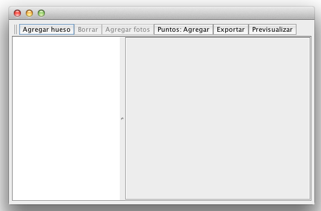
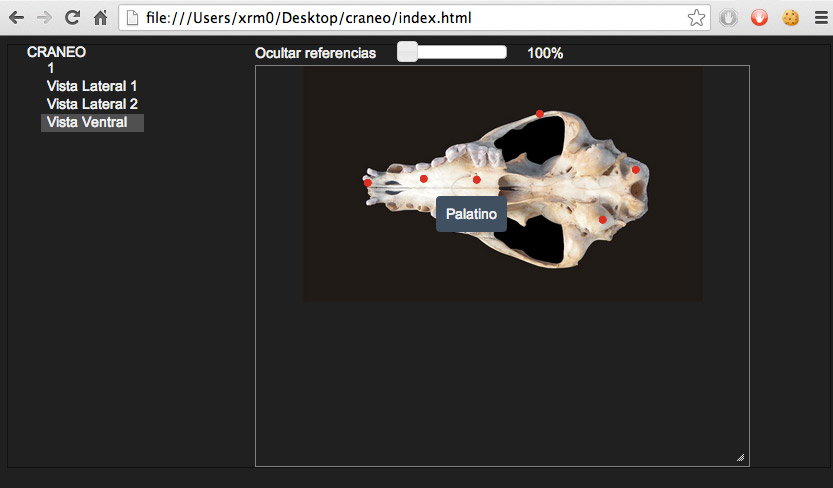

Caliboro
========

Caliboro es una aplicación con la que podemos agregar puntos de referencias a fotos de huesos con el fin de crear un atlas osteológico digital.

Una vez ingresadas las referencias, se exportan las imagenes como archivos .html que pueden ser visualizados con cualquier (no funciona en IE < 9) navegador.

Esta herramienta fue creada originalmente para que sea usada en el proyecto "Banco de esqueletos" del Instituto Secundario Argentino Danés “Alta Mira”.

Ejecución
-----------

Caliboro se distribuye de dos maneras, una versión para Windows y otra para el resto de las plataformas (OS X y Linux).

Hace falta tener Java instalado, en caso de no tenerlo se puede descargar de [http://www.java.com/en/download/index.jsp](http://www.java.com/en/download/index.jsp)

Para correr la versión de Windows, hacer doble click sobre el archivo .exe. Para otras plataformas, podríamos correr Caliboro desde la línea de comandos con: 'java -jar caliboro-x-release.jar' (reemplazando x por el número de versión del programa) o en algunos casos podría funcionar hacer doble click sobre el jar.

Almacenamiento de datos
-----------------------

Los datos ingresados con el programa (nombres de huesos, imágenes, nombres de los puntos de referencia y su posición dentro de las imágenes) son guardados en una carpeta. No deben modificarse manualmente estos archivos. 

Cada cambio realizado con el programa es guardado automáticamente.

Cada vez que corramos Caliboro deberemos seleccionar la carpeta donde se guardarán los datos que editemos. Esta carpeta puede ser una carpeta nueva o seleccionar una carpeta con la que estuvimos trabajando con anterioridad.

Luego de haber seleccionado la carpeta, debería aparecer una pantalla como la siguiente:

Funcionalidad
-------------

El programa permite:

  - Agregar / Borrar / Cambiar el nombre de un hueso.
  - Agregar / Borrar / Cambiar el nombre de una imagen asociada a un hueso.
  - Agregar / Borrar / Cambiar de lugar puntos en una imagen.
  - Cambiar el orden de huesos / imágenes arrastrandolos.
  - Cambiar el nivel de zoom de las imagenes que estamos editando

### Renombrar huesos / imágenes

Para renombrar un hueso / imagen hay que primero seleccionarlo (haciendo click sobre él) para luego hacer otro click sobre el texto. Esto permite cambiarle el nombre. Visualmente se vería así:

### Ver las imágenes de un hueso

Haciendo doble click sobre un hueso, se muestran (o se ocultan) las imágenes que tiene asociadas.

### Edición de puntos en una imagen

Clickeando sobre una imagen (en el listado de la izquierda), carga la imagen en la zona de la derecha de la pantalla.

La acción que se lleva a cabo al clickear sobre zonas de la imagen está determinada por el botón de la barra superior cuyo texto empieza con "Puntos: ". Podemos cambiar esta acción clickeando en el botón, alternando entre la opción de agregar / borrar puntos.

#### Agregar puntos

Cuando el botón muestra "Puntos: Agregar". Al clickear sobre la imagen se agregará un punto en la posición del mouse.

#### Borrar puntos

Cuando el botón muestra "Puntos: Borrar". Al clickear sobre un punto de la imagen, este será borrado.

#### Mover puntos

Si hacemos click sobre un punto existente en la imagen y sin soltar el botón movemos el mouse, el punto será movido junto al mouse.

#### Cambiar el nombre de un punto

Por el momento, la única manera de cambiar el nombre de un punto es borrarlo y crearlo de nuevo.

### Previsualizar

La previsualización nos permite ver como quedarían los datos que estamos editando una vez que sean exportados. Para que funcione correctamente esto es necesario tener instalado un navegador y que esté asociado a los archivos .html.

### Exportar

Esta funcionalidad nos permite guardar en una carpeta de nuestra elección un conjunto de archivos con la información de los huesos / imágenes que hemos editado. Debemos abrir con un navegador el archivo index.html dentro de la carpeta que seleccionamos anteriormente.

La imagen siguiente muestra una exportación mostrando el cráneo de un zorro pampeano.

En esta página podemos:

  * Ocultar / mostrar referencias óseas. Cuando se están mostrando las referencias, se puede ver el nombre pasando con el mouse sobre el punto
  * Hacer zoom de la foto

Licencia
========

Caliboro se distribuye bajo la licencia MIT. El texto completo de la licencia pueder [leerse aquí](LICENSE.txt).

Copyright (c) 2013 Luis Parravicini.

El ícono de la aplicación fue creado por Silvia Parravicini.

